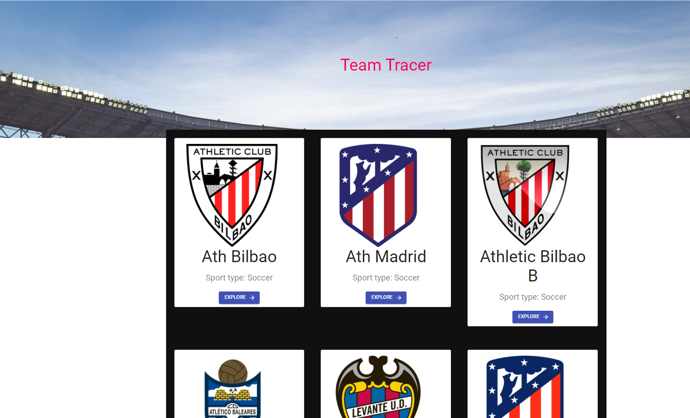
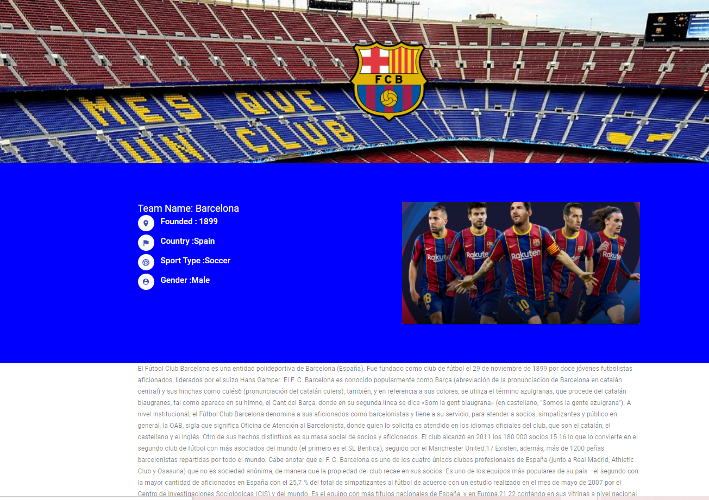

# Project: Soccer Snap
<h2>Project features</h2>

In this project, users can select and see team wise details information. The Football team data is coming from https://www.thesportsdb.com/api.php . In this project i am using React, React Router Dom, Materiul Ui.  

<h2>Project screenshot</h2>

 

<h1><a href="https://inspiring-heyrovsky-c7cd49.netlify.app/">Live</a></h2>